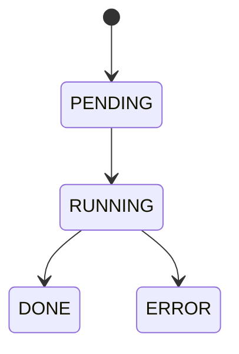

# Architecture

Put your high-level architecture here and link to RFCs.

## Vertical slice (suggested)

```mermaid
flowchart LR
  A[submit] --> B[compile] --> C[execute (sim)] --> D[results]
```

## Job lifecycle (example)


