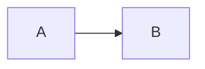

# Help (how to use this template)

This site is built with **MkDocs** + **Material for MkDocs**.

## Run locally

```bash
pip install -r requirements.txt
mkdocs serve
```

## Where files live

- `mkdocs.yml` – site config (nav, theme, plugins)
- `docs/` – Markdown pages
- `docs/stylesheets/extra.css` – Eigen OS “quantum field” theme overrides
- `docs/assets/` – logo, hero image, favicons

MkDocs copies non-Markdown files from `docs/` into the built site, so `docs/CNAME` ends up as `/CNAME` in the output.

## Admonitions (callouts)

```md
!!! note "Title"
    Body text
```

## Tabs

```md
=== "Linux"
    ```bash
    eigen submit job.yaml
    ```

=== "macOS"
    ```bash
    eigen submit job.yaml
    ```
```

## Mermaid diagrams

```md

```

Mermaid support is enabled via `pymdownx.superfences` in `mkdocs.yml`.

## Deploy to GitHub Pages

This bundle includes a GitHub Actions workflow in `.github/workflows/pages.yml`.

1. Push to `main`
2. GitHub → Settings → Pages → Source: **GitHub Actions**
3. Set custom domain to `www.eigen-os.org` (optional)
4. Configure DNS for `www` to point to GitHub Pages per GitHub docs
