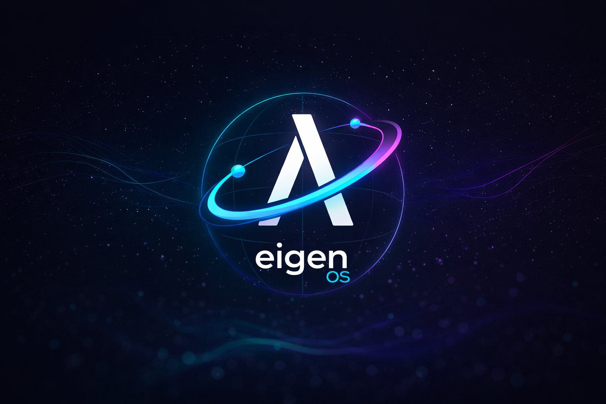

  
  

    eigenos
  

# Contract-first orchestration for hybrid quantum workflows

Stable contracts. Reproducible jobs. Vendor-neutral backends.

[Read the docs](intro.md){ .md-button .md-button--primary }
[GitHub](https://github.com/Eigen-OS/eigen-os){ .md-button }

